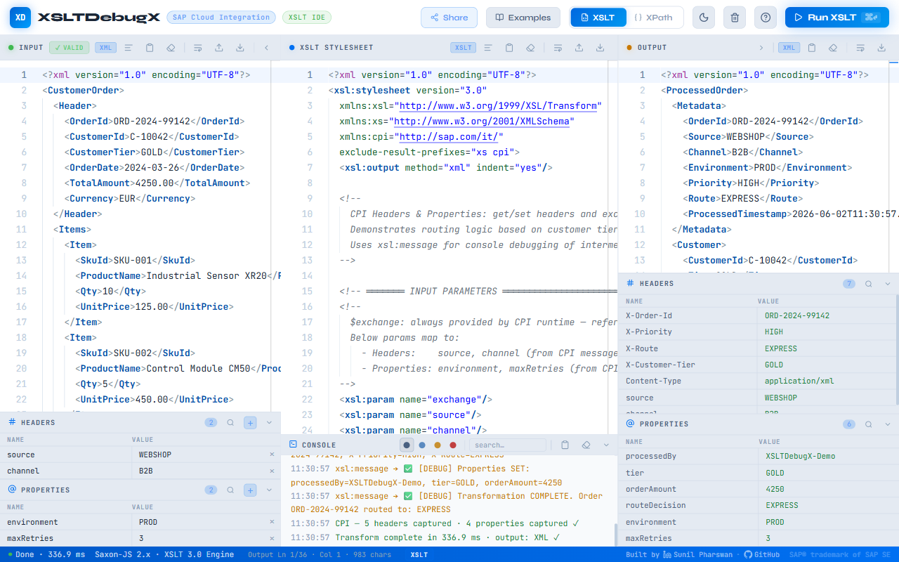
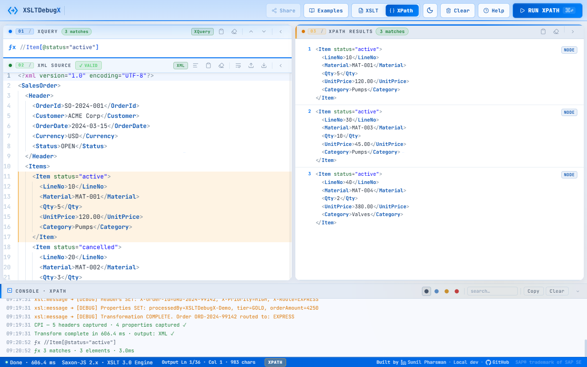

# XSLTDebugX — SAP Cloud Integration XSLT IDE

   [](LICENSE) [](https://github.com/linusdevx/XSLTDebugX/actions/workflows/e2e-tests.yml)   

> A browser-based XSLT 3.0 IDE and XPath evaluator built specifically for SAP Cloud Integration (CPI) developers. Test and debug XSLT mappings and XPath expressions locally — with full CPI runtime simulation — before ever deploying to your tenant.

**[🚀 Try it now: xsltdebugx.pages.dev](https://xsltdebugx.pages.dev)**

---

**XSLT mode** — XML input, XSLT stylesheet, and rendered output side-by-side, with CPI Headers / Properties panels and a console capturing `xsl:message` output:



**XPath mode** — query bar at the top, matched nodes highlighted in amber inside the XML, and a results panel showing each match:



---

## Why This Exists

SAP CPI's built-in mapping editor lacks live validation, an integrated debugger, and instant feedback on XSLT transformations. Testing iFlow XSLT requires simulating the runtime with correct headers and properties — a manual, error-prone process.

XSLTDebugX runs entirely in the browser with full CPI runtime simulation. Nothing to install. Open the page, paste your XML and XSLT, press **Ctrl+Enter**, and see the output — with headers, properties, and `xsl:message` traces in a live console. Instant feedback before deploying to CPI.

---

## Quick Start

### Use online

**[https://xsltdebugx.pages.dev](https://xsltdebugx.pages.dev)** — open in any browser. No account, no install.

### Run locally

Requires **Node.js ≥ 18** and **npm**.

```bash
git clone https://github.com/linusdevx/XSLTDebugX.git
cd XSLTDebugX
npm install         # installs devDependencies (Playwright, http-server, Vite)
npm run serve       # serve source files directly — no build needed for local dev
```

Then open <http://localhost:8000> in your browser. Or open `index.html` directly — no server required for basic use.

For the full local dev / debugging guide, see **[.github/docs/DEVELOPMENT.md](.github/docs/DEVELOPMENT.md)**.

### Keyboard shortcuts

| Shortcut | XSLT Mode | XPath Mode |
|---|---|---|
| `Ctrl+Enter` / `Cmd+Enter` | Run XSLT | Run XPath |
| `Enter` (in XQuery bar) | — | Run XPath |
| `↑` / `↓` (in XQuery bar) | — | Browse expression history |
| `Escape` | Close any open modal | Close any open modal |

---

## Quick Start Tutorial

### Testing a CPI XSLT mapping

1. **Load an example** — Click **Examples** → **SAP CPI Patterns** → **"CPI Headers & Properties (Complete)"**
2. **Review the setup** — XML input, XSLT stylesheet, and Headers/Properties panels are pre-filled
3. **Run it** — Press **Run XSLT** or `Ctrl+Enter`
4. **Check the output** — Output pane shows transformed XML; Output Headers/Properties show values set by `cpi:setHeader/setProperty`
5. **Watch the console** — Step-by-step debug messages from `xsl:message` with timestamps
6. **Modify it** — Change a header value (e.g., `channel` from `B2B` to `B2C`), press `Ctrl+Enter` again — routing logic changes instantly

### Evaluating XPath expressions

1. **Switch to XPath mode** — Click **ƒx XPath** in the header
2. **Load an XPath example** — Click **Examples** → **XPath Explorer** → **"Navigation & Predicates"**
3. **Click a hint chip** below the XPath input bar — runs the expression; matched nodes highlighted in amber
4. **Try your own** — Type `//Order[Total > 1000]` and press `Enter`
5. **Browse history** — `↑` / `↓` to navigate the last 20 expressions

---

## Features

A condensed highlight reel — the full catalog (200+ features with file/function pointers) lives in **[.github/docs/reference/features.md](.github/docs/reference/features.md)**.

- **Two modes, one app** — XSLT transform mode and XPath evaluator mode share the XML editor; loading an example switches automatically.
- **Monaco Editor** — XML/XSLT syntax highlighting, bracket-pair colorisation, live validation with inline squiggles, format/minify, word-wrap toggle, drag-drop file load.
- **CPI runtime simulation** — Headers and Properties injected as `xsl:param` (read via `$name`, exactly like real CPI), `cpi:setHeader`/`cpi:setProperty` fully evaluated, `$exchange` auto-injected, `xsl:message` streamed to console with `terminate="yes"` shown as warning. Deep dive: **[.github/docs/TRANSFORM.md](.github/docs/TRANSFORM.md)**.
- **XPath 3.1 evaluator** — namespace bindings (`xs`, `fn`, `math`, `map`, `array`) auto-provided; live syntax colorisation as you type; expression history (last 20); amber highlighting on matched nodes; right-click "Copy XPath — Exact / General".
- **Console** — colour-coded info/success/warn/error with timestamps, search, type filter, minimize/restore with error-count badge, auto-expand on errors.
- **Examples library** — built-in examples across 6 categories (Data Transformation, Aggregation, Format Conversion, XSLT 3.0 Advanced, SAP CPI Patterns, XPath Explorer); searchable; one-click load.
- **Share** — XML + XSLT + headers + properties encoded in a URL; never hits a server. (XPath mode is not shareable.)
- **Session persistence** — everything auto-saved to `localStorage` 800ms after you stop typing; **Clear Session** is mode-aware.
- **Output detection** — auto-detects XML / JSON / plain text from the actual output, switches Monaco language, updates download filename.
- **Theme toggle, column collapse, status bar with cursor position, help modal, responsive layout.**

---

## CPI Cheat Sheet

XSLTDebugX rewrites `cpi:setHeader` / `cpi:setProperty` to Saxon-JS's `js:` namespace before running the transform, so the setters work just like in CPI. Reads use `<xsl:param name="X"/>`, populated automatically from the Headers/Properties panels — the same pattern CPI uses at runtime. For namespace rewriting, error line mapping, and interceptor patterns, see **[.github/docs/TRANSFORM.md](.github/docs/TRANSFORM.md)**.

```xslt
<xsl:stylesheet version="3.0"
  xmlns:xsl="http://www.w3.org/1999/XSL/Transform"
  xmlns:cpi="http://sap.com/it/"
  xmlns:xs="http://www.w3.org/2001/XMLSchema"
  exclude-result-prefixes="cpi xs">

  <xsl:param name="SAPClient"/>                                   <!-- bound automatically from Headers panel -->

  <xsl:value-of select="cpi:setHeader($exchange, 'OrderRef', concat('REF-', Id))"/>
  <xsl:value-of select="cpi:setProperty($exchange, 'Status', if (Amount gt 1000) then 'HIGH' else 'LOW')"/>

  <xsl:message select="concat('🔵 client = ', $SAPClient)"/>       <!-- shows in console -->
  <xsl:message terminate="yes" select="'FATAL: bad status'"/>      <!-- shown as warning -->
</xsl:stylesheet>
```

**Right-click any element in XPath mode** for **Copy XPath — Exact** (positional) or **Copy XPath — General** (pattern) to drop into stylesheets.

The "CPI Headers & Properties (Complete)" example exercises all four extension functions with annotated `xsl:message` traces — load it from the Examples library as a working reference.

---

## CPI Helper Integration

The community-maintained **[CPI Helper Chrome extension](https://github.com/dbeck121/CPI-Helper-Chrome-Extension)** by **[@dbeck121](https://github.com/dbeck121)** has built-in support for sending CPI runtime traces straight into XSLTDebugX — no copy-paste between tabs.

When you run an iFlow in trace mode, CPI Helper highlights every XSLT Mapping step that captured trace data. Click a highlighted step, choose **Debug Externally**, and pick what to forward (message body, XSLT, headers, properties). The extension compresses the payload into XSLTDebugX's share-URL format and opens it here — fully populated, ready to re-run with the exact runtime context that produced the original output.

Useful when:
- A transform works in your local tests but fails in CPI — pull the real trace and diff against your test fixtures.
- You need to reproduce a production issue without redeploying.
- You want to share a failing case with a teammate via a single share URL.

Tested working with the current XSLTDebugX share-URL format. The plugin is third-party and maintained separately; install it from the [CPI Helper repository](https://github.com/dbeck121/CPI-Helper-Chrome-Extension) and report plugin issues there.

---

## FAQ

### Can I use this for production CPI flows?
**Yes, with testing.** XSLTDebugX simulates the CPI XSLT runtime accurately for standard XSLT 3.0 and CPI extension functions. Always test in your CPI development tenant before promoting to production.

### Does this work offline?
**Partially.** After first load, the app works offline from browser cache. Monaco Editor and fonts come from CDN — offline mode may have degraded styling. Saxon-JS is bundled locally and works offline.

### Can I save my work?
**Three ways:** auto-save to `localStorage`, **Share** URL with full session, or **Download** individual panes as files.

### Why is my XSLT slow?
Large XML (>100 KB) or complex recursive templates can be slow — Saxon-JS is interpreted JavaScript, not compiled. Use `xsl:message` to identify bottleneck templates.

### Does this support XSLT 1.0?
**No.** Saxon-JS 2.x is XSLT 3.0 only. Upgrade to `version="3.0"` or use an XSLT 1.0 processor.

### Why are my namespaces stripped from output?
Check `exclude-result-prefixes="cpi xs"` — namespaces declared but not in the exclude list will appear in output.

### Can I debug multi-step CPI flows?
**One step at a time.** XSLTDebugX simulates a single XSLT mapping step. Chain steps manually: copy the output of one transform into the input of the next.

### Can I submit examples?
**Yes!** Fork the repo, add your example to `js/examples-data.js`, and open a PR. See **[.github/docs/reference/examples-data.md](.github/docs/reference/examples-data.md)** for the schema.

---

## Troubleshooting

### "Saxon not ready" error
Saxon-JS hasn't loaded yet (slow network or CDN blocked). Wait 2–3 seconds; if it persists, check the browser console for CDN errors.

### Transform produces no output
Most often: XML or XSLT not well-formed (look for red squiggles), no matching templates (start from "Identity Transform"), or `xsl:message terminate="yes"` halted execution (check the console).

### Headers / Properties not picked up
Param names in the XSLT must match the Headers / Properties panel exactly — case-sensitive. Load **"CPI Headers & Properties (Complete)"** as a reference.

For more recipes (XPath empty results, lost session, console filtering), see **[.github/docs/DEVELOPMENT.md](.github/docs/DEVELOPMENT.md)**.

---

## Known Limitations

| Limitation | Detail | Workaround |
|---|---|---|
| `$exchange` not a real object | Injected as a dummy string — only works as the first argument to `cpi:setHeader`/`cpi:setProperty` | Always pass `$exchange` as first param |
| Share URL length | Browser URL limit ~2,000 chars; large XSLT + XML may exceed this | Use **Download** for large payloads |
| Share is XSLT only | XPath expressions and XPath mode aren't included in share URLs | Screenshot results or copy the expression manually |
| Large file performance | Files >500 KB may slow Monaco | Split large IDocs or pre-clean in an external editor |
| No XSLT debugger | Cannot step through templates or inspect variables mid-execution | Use `xsl:message` extensively to trace flow |

---

## Architecture & Dependencies (at a glance)

Vanilla JavaScript, 12 modules, no module system, **no npm runtime dependencies**. Monaco Editor and pako load from CDN; Saxon-JS is bundled locally in `lib/`.

| Component | Type | Purpose |
|---|---|---|
| **Monaco Editor** | CDN (`cdn.jsdelivr.net`) | Code editing & syntax highlighting |
| **Lucide Icons** | CDN (`unpkg.com`) | UI icons |
| **pako** | CDN (`cdnjs.cloudflare.com`) | Share-URL compression |
| **Saxon-JS 2.x** | Bundled (`lib/SaxonJS2.js`, MPL-2.0) | XSLT 3.0 + XPath 3.1 engine |
| **`@playwright/test`, `http-server`, `vite`** | Dev only | Tests, local server, production build |

Hosted on **Cloudflare Pages**, auto-deploys from `main`. CI (GitHub Actions) runs the Playwright E2E suite against the production bundle on every push and PR. For module dependency graphs, data-flow diagrams, the build pipeline, and design principles, see **[.github/docs/ARCHITECTURE.md](.github/docs/ARCHITECTURE.md)**; for the testing setup, see **[.github/docs/TESTING.md](.github/docs/TESTING.md)**.

---

## Support

- **Bugs and feature requests** — [GitHub Issues](https://github.com/linusdevx/XSLTDebugX/issues)
- **Questions** — start by checking the [FAQ](#faq) or [.github/docs/DEVELOPMENT.md](.github/docs/DEVELOPMENT.md)
- **Security** — for sensitive reports, please use [GitHub Security Advisories](https://github.com/linusdevx/XSLTDebugX/security/advisories) instead of public issues

---

## Contributing

PRs welcome — actively maintained, issues and example submissions appreciated. Read **[CONTRIBUTING.md](CONTRIBUTING.md)** for the code-style guide, commit format, testing checklist, and PR process. Example schemas (XSLT examples, XPath examples, new categories) are documented in **[.github/docs/reference/examples-data.md](.github/docs/reference/examples-data.md)**.

---

## License

AGPL-3.0-or-later — see [LICENSE](LICENSE) for full text.

### Third-Party Licenses

| Library | License | Usage |
|---|---|---|
| [Saxon-JS 2.x](https://www.saxonica.com/saxon-js/documentation/index.html) | [MPL-2.0](https://www.mozilla.org/en-US/MPL/2.0/) | XSLT/XPath engine — bundled in `lib/SaxonJS2.js` |
| [Monaco Editor](https://microsoft.github.io/monaco-editor/) | [MIT](https://github.com/microsoft/monaco-editor/blob/main/LICENSE.md) | Code editor — CDN |
| [Pako](https://github.com/nodeca/pako) | [MIT](https://github.com/nodeca/pako/blob/master/LICENSE) | Share-URL compression — CDN |
| [JetBrains Mono](https://www.jetbrains.com/legalforms/fonts/) | [OFL-1.1](https://scripts.sil.org/OFL) | Monospace font — Google Fonts |

### Trademarks

SAP®, SAP Cloud Integration, and SAP Cloud Platform Integration (CPI) are registered trademarks of SAP SE. SuccessFactors® and IDoc® are trademarks or registered trademarks of SAP SE.

This project is not affiliated with, endorsed by, or in any way officially connected with SAP SE.
